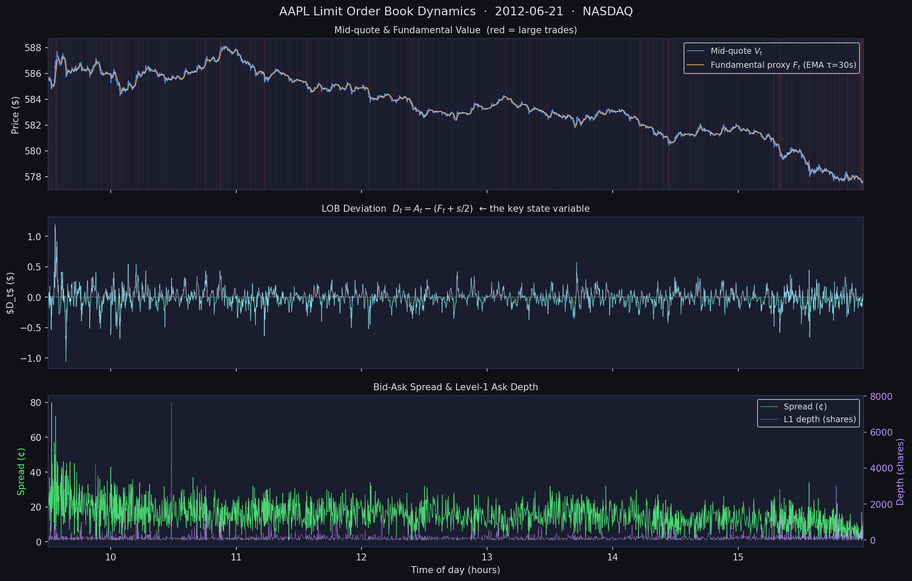
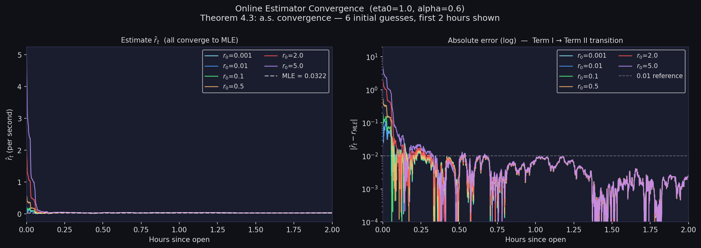
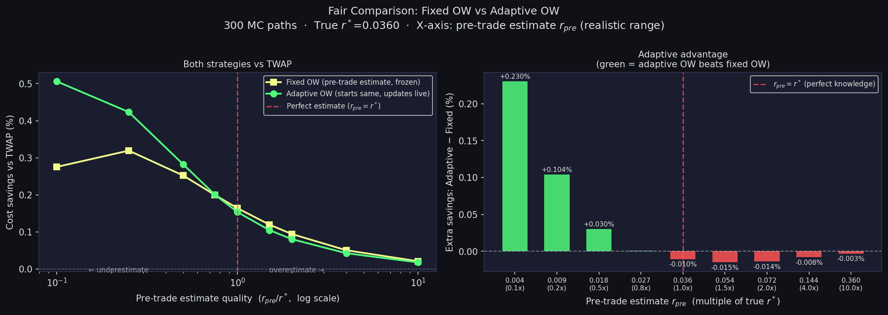

# Adaptive LOB Execution via Online Parameter Estimation

**Adaptive execution of large orders in a limit order book market,
where the key market microstructure parameter (LOB resilience $r$) is
unknown and estimated in real time using a provably convergent online estimator.**

---



---

## Overview

When executing a large order, a trader faces a fundamental problem:
the optimal strategy depends on the *resilience* $r$ of the limit
order book — the speed at which liquidity recovers after a trade —
but $r$ is unobservable and varies over time.

This project combines two contributions:

1. **[Obizhaeva & Wang (2013)](https://doi.org/10.1016/j.finmar.2012.09.001)** —
   the optimal execution strategy when $r$ is known (closed-form solution, Proposition 3).

2. **Wu (2026)** PhD thesis —
   a continuous-time online estimator for unknown parameters in controlled
   stochastic systems, with almost-sure convergence guaranteed *without*
   assuming stationarity or time-scale separation.

The result is a **fully adaptive execution system** where the estimator
and controller operate simultaneously on the same time scale, each
influencing the other through the LOB dynamics.

---

## Results

### Estimator convergence (Theorem 4.3)

Starting from 6 very different initial guesses, $\hat{r}_t$ converges
to the MLE estimate of $r^*$ in all cases — consistent with the
almost-sure convergence theorem in the thesis.



---

### Key finding: adaptive beats static under misspecification

In practice $r^*$ is unknown and the practitioner relies on a prior
guess $r_0$. A **static** strategy freezes $r_0$ forever. The
**adaptive** strategy starts from the same $r_0$ but learns $r^*$
as trading proceeds.



When $r_0 < r^*$ (underestimating resilience — the common case),
the adaptive strategy saves meaningful cost over the static strategy.
For example with $r_0 = 0.01$ vs true $r^* = 0.036$:

| Strategy | Mean cost | vs TWAP |
|----------|-----------|---------|
| TWAP (baseline) | \$2,954,470 | — |
| Static OW ($r_0 = 0.01$, frozen) | \$2,945,224 | +0.31% savings |
| **Adaptive OW ($r_0 = 0.01$, learns $r^*$)** | **\$2,942,468** | **+0.41% savings** |

*300 Monte Carlo paths · $X_0 = 5{,}000$ shares · $T = 390$ s · AAPL calibrated parameters.*

The adaptive strategy saves an extra **\$2,756 per execution** over a static
strategy using the same (wrong) starting guess.

---

## The Closed-Loop System

The three components are genuinely coupled — this is what distinguishes
this project from a standard backtest:

```
  ┌──────────────────────────────────────────────────────┐
  │                                                      │
  │  r_hat_{t-}  ──→  m_t = OW(r_hat_{t-}, X_t)         │
  │       ↑                        │                     │
  │       │            dD_t = -r* D_t dt                 │
  │   Estimator               - k·m_t dt                 │
  │   (Eq. 3.2)           + sigma·dB_t                   │
  │       │                        │                     │
  │       └──────── D_t, dD_t ─────┘                     │
  │                                                      │
  └──────────────────────────────────────────────────────┘
```

$\hat{r}_t$ drives $m_t$, which changes $D_t$, which drives $\hat{r}_{t+dt}$.
The data is **not fixed** — it is generated by the system itself.
This is the closed-loop adaptive setting studied in the thesis, and
Theorem 4.3 guarantees $\hat{r}_t \to r^*$ a.s. even in this non-stationary regime.

---

## The Model

### OW LOB dynamics (Obizhaeva & Wang 2013)

$$dD_t = -r \, D_t \, dt - k \, dX_t + \sigma \, dB_t$$

| Symbol | Meaning | AAPL calibrated value |
|--------|---------|----------------------|
| $D_t = A_t - (F_t + s/2)$ | Ask deviation above steady state | — |
| $r$ | **Resilience** (unknown, to be estimated) | $0.036$ /s · half-life ≈ 19 s |
| $k = 1/q - \lambda$ | Price impact coefficient | $0.005$ |
| $\sigma$ | LOB noise volatility | $0.034$ \$/√s |
| $q$ | Level-1 market depth | 100 shares |

Parameters calibrated from LOBSTER AAPL data (2012-06-21, NASDAQ).

### Online estimator (Wu 2026, Eq. 3.2)

$$d\hat{r}_t = \eta_t \underbrace{(-D_t)}_{\partial f/\partial r} \sigma^{-2}
\underbrace{\left[\frac{dD_t}{dt} + \hat{r}_t D_t\right]}_{\text{innovation}} dt
+ \text{martingale term}$$

**Theorem 4.3:** Under standard regularity, monotonicity, and learning-rate
conditions ($\int \eta_t \, dt = \infty$, $\int \eta_t^2 \, dt < \infty$),
$\hat{r}_t \to r^*$ almost surely — *without* stationarity of $D_t$
or time-scale separation between estimator and controller.

### Adaptive OW controller (Proposition 3, OW 2013)

$$m_t = \frac{\hat{r}_{t-} \, X_t}{\hat{r}_{t-}(T-t) + 2}, \qquad
x_0 = x_T = \frac{X_0}{\hat{r}_0 \, T + 2}$$

The controller uses the **lagged** estimate $\hat{r}_{t-}$
(Eq. 2.2 in the thesis), ensuring measurability of the closed-loop system.

---

## Project Structure

```
lob-adaptive-execution/
│
├── data/
│   ├── AAPL_2012-06-21_*_message_5.csv      ← LOBSTER tick data
│   └── AAPL_2012-06-21_*_orderbook_5.csv
│
├── src/
│   ├── lobster.py      ← LOBSTER data loading & LOB state variables
│   ├── estimator.py    ← Online estimator (Wu 2026, Eq. 3.2)
│   └── ow_model.py     ← OW simulation environment & all three strategies
│
├── notebooks/
│   ├── 01_data_exploration.ipynb      ← LOB dynamics, Dt, trade stats
│   ├── 02_parameter_estimation.ipynb  ← Estimator convergence analysis
│   └── 03_adaptive_execution.ipynb    ← Simulation & cost comparison
│
├── assets/                            ← README figures
├── requirements.txt
└── README.md
```

---

## Data

LOBSTER sample data (free, no registration required):

- **Source:** [lobsterdata.com](https://data.lobsterdata.com/info/DataSamples.php)
- **Ticker:** AAPL · **Date:** 2012-06-21 · **Levels:** 5
- **Coverage:** Full trading day 09:30–16:00, 301,587 events

Download `LOBSTER_SampleFile_AAPL_2012-06-21_5.zip` and unzip the two
CSV files into the `data/` directory.

---

## Installation & Usage

```bash
git clone https://github.com/wuc3/lob-adaptive-execution
cd lob-adaptive-execution

pip install -r requirements.txt

# Place LOBSTER CSV files in data/

jupyter notebook notebooks/01_data_exploration.ipynb
```

Run notebooks in order: **01 → 02 → 03**.

---

## References

- Obizhaeva, A. & Wang, J. (2013). *Optimal trading strategy and
  supply/demand dynamics.* Journal of Financial Markets 16, 1–32.
  [doi:10.1016/j.finmar.2012.09.001](https://doi.org/10.1016/j.finmar.2012.09.001)

- Wu, C. (2026). *Adaptive Control and Online Parameter Estimation
  for Stochastic Systems.* PhD Thesis, Florida State University.

- LOBSTER: Limit Order Book System — The Efficient Reconstructor.
  Humboldt University Berlin. [lobsterdata.com](https://lobsterdata.com)

---

## Author

**Changkui Wu**  
PhD, Financial Mathematics — Florida State University (2026)  
B.S. Finance — Miami University (2015)  
M.S. Statistics — Florida State University (2018)
